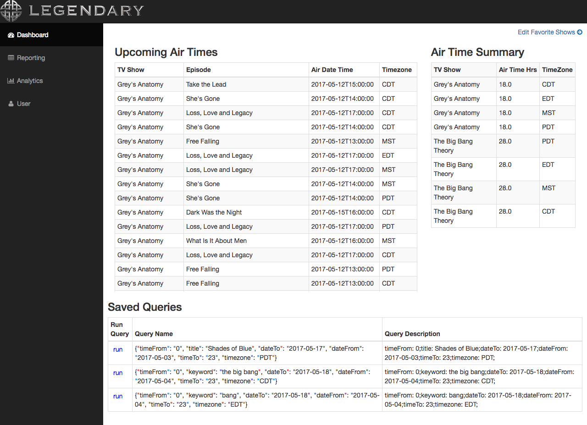
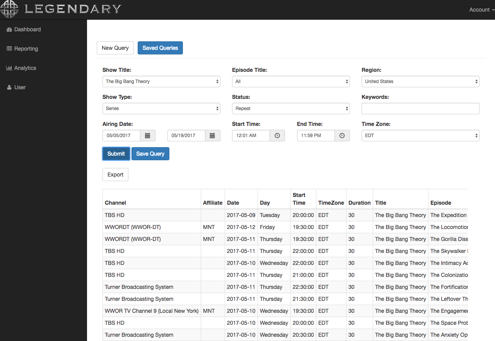
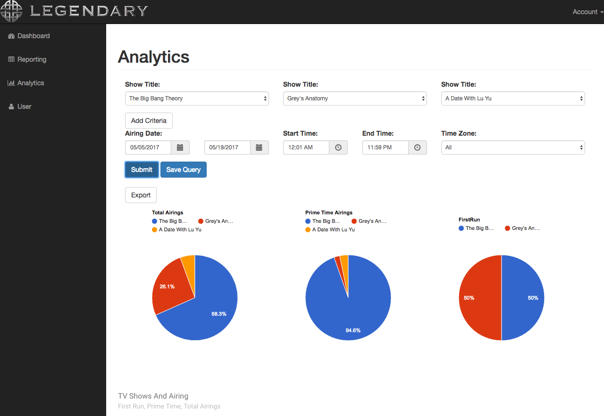
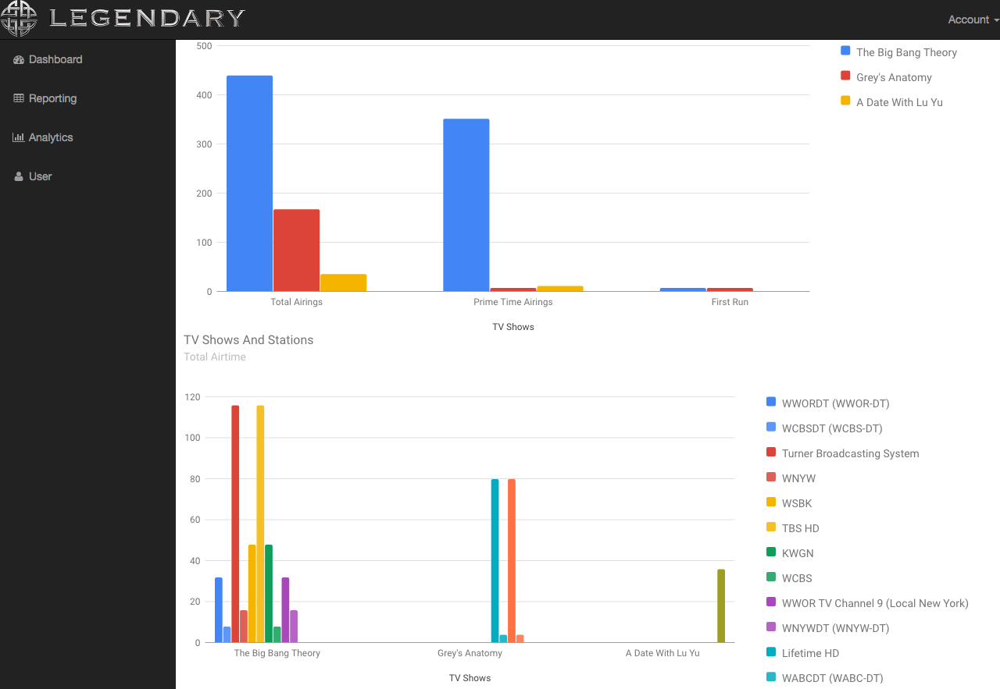
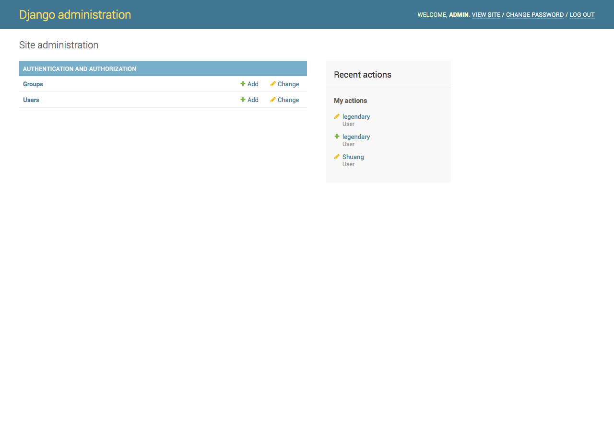

# Legendary Front End
## Status
Four tabs including dashboard/reporting/analytics/users are ready.

## Requirements
- django==1.10.6
- reportlab==3.4.0
- requests==1.2.3
- psycopg2==2.7.1
- django-filter==1.0.2
- djangorestframework==3.6.2
- markdown==2.6.8


## Repository contents
- legendary_capstone-master/: contains code for api, which handles request from frontend and fetches data from database
  ```
  ├── api
  │   ├── __init__.py
  │   ├── admin.py
  │   ├── apps.py
  │   ├── migrations
  │   │   └── __init__.py
  │   ├── models.py
  │   ├── tests.py
  │   ├── urls.py
  │   └── views.py
  ├── capstone
  │   ├── __init__.py
  │   ├── nohup.out
  │   ├── settings.py
  │   ├── urls.py
  │   └── wsgi.py
  ├── db.sqlite3
  ├── derby.log
  ├── manage.py
  ├── metastore_db
  ```
  - The project layout follows the default settings for Django project.
  - api/: Django Web application which contains our main functional code. Two main files we modified are
    - views.py: actually returns HttpResponse object containing the content for the request
    - urls.py: contains a list of url patterns
  - capstone/: contains site settings for the api server. Two main files we modified are
    - settings.py: Settings/configuration for this Django project. Django settings will tell you all about how settings work.
    - urls.py: The URL declarations for this Django project; a “table of contents” of your Django-powered site.
- mysite/: contains code for frontend
  ```
  ├── analytics
  │   ├── __init__.py
  │   ├── admin.py
  │   ├── migrations
  │   ├── models.py
  │   ├── static
  │   ├── templates
  │   ├── urls.py
  │   └── views.py
  ├── dashboard
  │   ├── __init__.py
  │   ├── admin.py
  │   ├── apps.py
  │   ├── migrations
  │   ├── models.py
  │   ├── templates
  │   ├── tests.py
  │   ├── urls.py
  │   └── views.py
  ├── db.sqlite3
  ├── manage.py
  ├── mysite
  │   ├── __init__.py
  │   ├── settings.py
  │   ├── templates
  │   ├── urls.py
  │   └── wsgi.py
  ├── nohup.out
  ├── report
  │   ├── __init__.py
  │   ├── admin.py
  │   ├── migrations
  │   ├── models.py
  │   ├── static
  │   ├── templates
  │   ├── tests.py
  │   ├── urls.py
  │   └── views.py
  ├── static
  │   ├── LICENSE
  │   ├── README.md
  │   ├── blank-page.html
  │   ├── bootstrap-elements.html
  │   ├── bootstrap-grid.html
  │   ├── charts.html
  │   ├── css
  │   ├── font-awesome
  │   ├── fonts
  │   ├── forms.html
  │   ├── img
  │   ├── index-rtl.html
  │   ├── index.html
  │   ├── js
  │   └── tables.html
  └── users
      ├── __init__.py
      ├── admin.py
      ├── apps.py
      ├── forms.py
      ├── migrations
      ├── models.py
      ├── templates
      ├── tests.py
      ├── urls.py
      └── views.py
  ```
  - The project layout follows the default settings for Django project.
  - analytics/, dashboard/, report/, users/: four Django Web applications containing code for four tabs on frontend
  - static/: contains css, javascript files
  - mysite/: contains site settings for the frontend server
    ​

**Templates:**
We use [bootstrap SB Admin template](https://startbootstrap.com/template-overviews/sb-admin/) as the website templates for bootstrap. The html file is under the templates folder for each Django app. CSS and Javascript files are under mysite/static/.


**References:**
[django Documentation](https://docs.djangoproject.com/en/1.10/intro/)
[bootstrap SB Admin template](https://startbootstrap.com/template-overviews/sb-admin/)


## How to use
If you are going to run the server on local, you may need to change the settings file LegendaryFrontEnd/mysite/mysite/settings.py, **replace the TEMPLATES.DIRS paths and STATICFILES_DIRS to the path on local machine**.

Run on the background
```
# start api server on port 8080
cd legendary_capstone-master/
nohup python manage.py runserver 0.0.0.0:8080 &

# start frontend server
cd ..
cd mysite/
nohup python manage.py runserver 0.0.0.0:8000 &
```

## Views

### Dashboard



### Reporting



### Analytics





### Users


